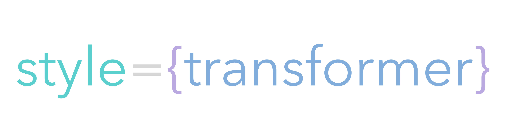

## Deprecated! There are far better solutions to these methods nowaydays. 

<h1 align="center"></div>
</h1>
[](https://travis-ci.org/rofrischmann/inline-style-transformer)
[](https://codeclimate.com/github/rofrischmann/inline-style-transformer/coverage)
[](https://codeclimate.com/github/rofrischmann/inline-style-transformer)
[](http://badge.fury.io/js/inline-style-transformer)


# Usage
```sh
npm install inline-style-transformer --save
```
### Methods
* [toCSS](#tocssstyles--options)
* [toObject](#toObjectcss--options)
* [importantify](#importantifystyles)

## `toCSS(styles [, options])`
Takes a `styles` object and generates a valid CSS string. Property names get converted to dash-case and plain numbers *(if they're not unitless properties)* get a configurable unit applied.
```javascript
import { toCSS } from 'inline-style-transformer'

const styles = {
	fontSize: 15,
	color: 'red',
	transform: 'rotate(30deg)'
}

// basic object to CSS string
const CSS = toCSS(styles)
CSS === 'font-size:15px;color:red;transform:rotate(30deg)'

// custom unit transformation
CSS = toCSS(styles, 'em')
CSS === 'font-size:15em;color:red;transform:rotate(30deg)'
```

### Options
#### `unit`
*default to `px`*

Add a unit which gets added to plain numbers.
```javascript
toCSS({width: 30}, {unit: 'em'}) === 'width:30em'
```

### `ruleSeparator`, `selectorSeparator` & `indent`
*default to '' (empty string)*

Used to format the output rules and classes.

```javascript
const styles = {
  '.class1': {
    fontSize: 30,
    color: 'red'
  }
}
const options = {
  ruleSeparator: '\n',
  selectorSeparator: '\n',
  indent: '  ' // 2 spaces
}
const CSS = toCSS(styles, options)
```
Will output a formatted CSS string:
```CSS
.class1 {
  font-size: 30px;
  color: red
}
```


## `toObject(CSS [, options])`
Converts a `CSS` string to a optimized javascript object. Property names get camel-cased and number values get converted to pure numbers if possible.

```javascript
import { toObject } from 'inline-style-transformer'

const CSS = 'font-size:15px;color:red;transform:rotate(30deg)'

// values with px also get
// converted to pure numbers
const styles = toObject(CSS)
styles === {fontSize: 15, color: 'red', transform: 'rotate(30deg)'}
```
#### Advanced
You can also use the new ECMAScript 2015 template strings. This let's you effectively write CSS within javascript. <br>
`objectifyCSS` will automatically normalize all tabs and line-breaks.

```javascript
const CSS = `
	font-size: 15px;
	color: red;
	transform: rotate(30deg)
`

const styles = toObject(CSS)
styles === {fontSize: 15, color: 'red', transform: 'rotate(30deg)'}
```

### Options
##### `replacer`
Optionally you may pass an object containing replacement rules. Those are used to transform multi-selector CSS into an object.

*default is `{'.' : ''}` which replaces the CSS class prefix `.` with an empty string.*

```javascript
const CSS = `
  .class1 {
	  font-size: 15px;
	  color: red;
	  transform: rotate(30deg)
  }
  .class2 {
    background-color: blue
  }
`

const styles = toObject(CSS)
// styles === transformed
const transformed = {
  class1: {
    fontSize: 15,
    color: 'red',
    transform: 'rotate(30deg)'
  },
  class2: {
    backgroundColor: 'blue'
  }
}
```

# License
**inline-style-transformer** is licensed under the [MIT License](http://opensource.org/licenses/MIT).<br>
Documentation is licensed under [Creative Common License](http://creativecommons.org/licenses/by/4.0/).<br>
Created with ♥ by [@rofrischmann](http://rofrischmann.de).

# Contributing
I would love to see people getting involved.<br>
If you have a feature request please create an issue. Also if you're even improving inline-style-transformer by any kind please don't be shy and send a pull request to let everyone benefit.

### Issues
If you're having any issue please let me know as fast as possible to find a solution a hopefully fix the issue. Try to add as much information as possible such as your environment, exact case, the line of actions to reproduce the issue.

### Pull Requests
If you are creating a pull request, try to use commit messages that are self-explanatory. Also always add some **tests** unless it's totally senseless (add a reason why it's senseless) and test your code before you commit so Travis won't throw errors.
